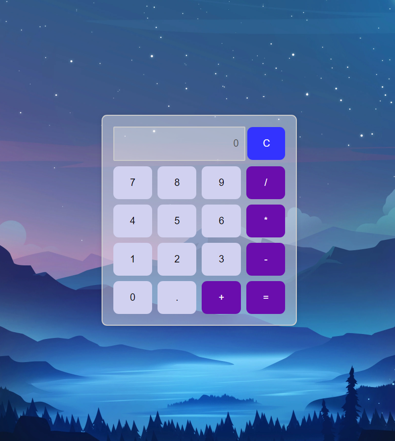

# 🌌✨ Calculadora
 
## 🎯 Propósito
El propósito de este proyecto es proporcionar una calculadora simple con una interfaz atractiva.



Bienvenidos a **Calculadora** – una aplicación de calculadora simple y hermosa con un toque nocturno. 🌙

## 🌐 Demo en Vivo

Puedes ver la calculadora en acción aquí: [Link de la Calculadora](https://delightful-hill-040df621e.5.azurestaticapps.net/) 🚀

## 📂 Estructura del Proyecto

- **index.html:** Contiene la estructura principal de la calculadora.  
- **styles.css:** Define los estilos de la calculadora, incluyendo el diseño responsivo.  
- **script.js:** Contiene la lógica de la calculadora para manejar las operaciones y la interacción del usuario.

## 🛠️ Cómo iniciar el proyecto localmente

1. **Clona este repositorio**:
   ```bash
   git clone https://github.com/20242-Ingenieria-Web-Udea-MJ/taller-html-Rony-Ba-ol
   ```
2. **Abre el archivo /src/index.html**:
